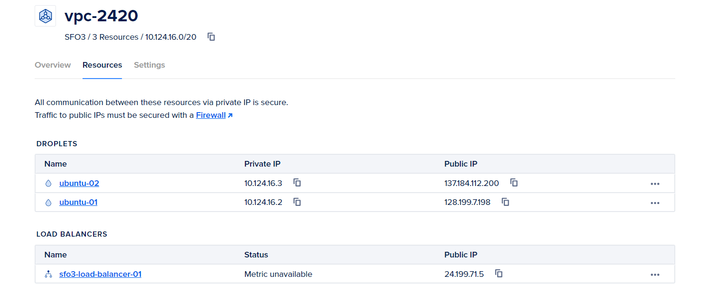
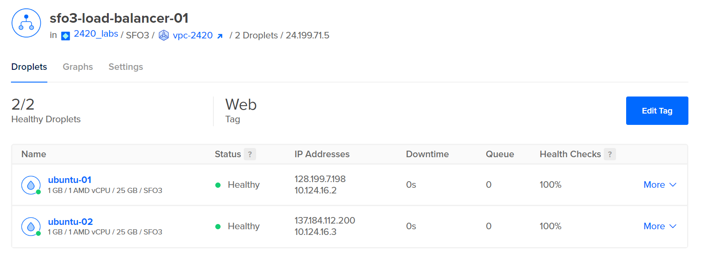
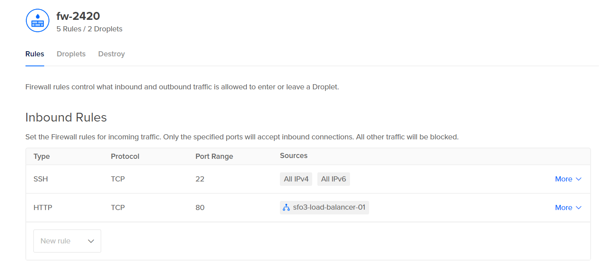
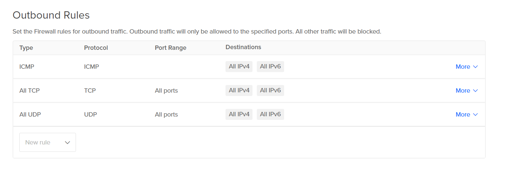

# 2420_assign2

## Author
- Braeden Venne

## Creating a DO Infrastructure
Follow the setup provided in Week 13:
- https://vimeo.com/775412708/4a219b37e7

**Don't forget to add a tag to your droplets!**

The infrastructure should contain the following:
-  VPC
- At least 2 Droplets
- Load Balancer 
- DigitalOcean Cloud firewall

Example DO Setup:

1. VPC <br>


2. Load Balancer <br>


3. DigitalOcean Cloud Firewall <br>



**Once the infrastructure has been setup create a new regular user on both your droplets**

## Installing Caddy on Your Droplets
1. On your droplet run the following:
```
sudo apt install -y debian-keyring debian-archive-keyring apt-transport-https
curl -1sLf 'https://dl.cloudsmith.io/public/caddy/stable/gpg.key' | sudo gpg --dearmor -o /usr/share/keyrings/caddy-stable-archive-keyring.gpg
curl -1sLf 'https://dl.cloudsmith.io/public/caddy/stable/debian.deb.txt' | sudo tee /etc/apt/sources.list.d/caddy-stable.list
sudo apt update
sudo apt install caddy
```
**For more info on installing Caddy with apt visit the link below:**<br>
https://caddyserver.com/docs/install

## Creating the web app
