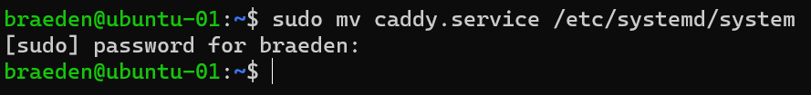
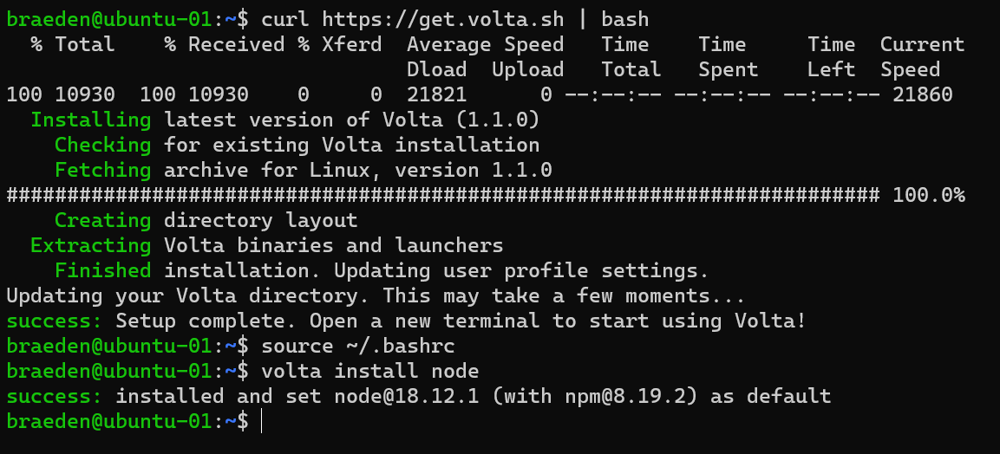
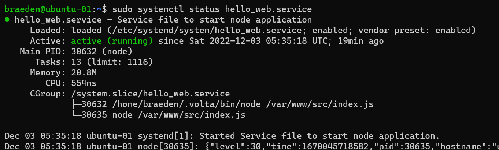
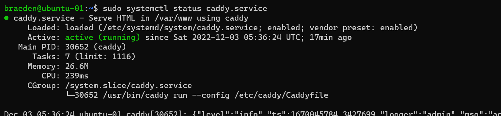
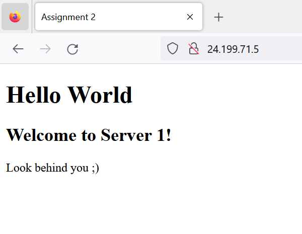
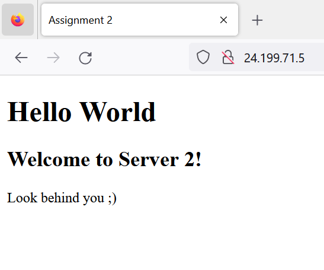

# 2420_assign2

## Author
- Braeden Venne

## Creating a DO Infrastructure
Follow the setup provided in Week 13:
- https://vimeo.com/775412708/4a219b37e7

**Don't forget to add a tag to your droplets!**

The infrastructure should contain the following:
-  VPC
- At least 2 Droplets
- Load Balancer 
- DigitalOcean Cloud firewall

Example DO Setup:

1. VPC <br>


2. Load Balancer <br>


3. DigitalOcean Cloud Firewall <br>


**Once the infrastructure has been setup create a new regular user on both your droplets**

## Installing Caddy on Your Droplets
1. On your droplet run the following:
```
sudo apt install -y debian-keyring debian-archive-keyring apt-transport-https
curl -1sLf 'https://dl.cloudsmith.io/public/caddy/stable/gpg.key' | sudo gpg --dearmor -o /usr/share/keyrings/caddy-stable-archive-keyring.gpg
curl -1sLf 'https://dl.cloudsmith.io/public/caddy/stable/debian.deb.txt' | sudo tee /etc/apt/sources.list.d/caddy-stable.list
sudo apt update
sudo apt install caddy
```
**Repeat this step on both droplets!**

**For more info on installing Caddy with apt visit the link below:**<br>
https://caddyserver.com/docs/install

## Creating the web app
1. In your **WSL** create a new directory 
```
mkdir as2
```
2. Inside of this directory create 2 new directories **html** and **src**
```
mkdir as2/html && mkdir as2/src
```
3. Inside the **html** folder create a simple but complete **index.html** file

Example index.html file:
```
<!DOCTYPE html>
<html lang="en">
<head>
    <meta charset="UTF-8">
    <meta http-equiv="X-UA-Compatible" content="IE=edge">
    <meta name="viewport" content="width=device-width, initial-scale=1.0">
    <title>Assignment 2</title>
</head>
<body>
    <h1>Hello World</h1>
    <p>Look behind you ;)</p>
</body>
</html>
```
4. Inside the **src** folder create a new node project
```
npm init
```
Note: when given the prompts after running **npm init** keep pressing **enter** 

Example output: <br>


5. Inside the **src** folder Install fastify
```
npm i fastify
```
Example output:


6. Inside the **src** folder create an **index.js** file with the following contents
```
// Require the framework and instantiate it
const fastify = require('fastify')({ logger: true })

// Declare a route
fastify.get('/', async (request, reply) => {
  return { hello: 'Server x' }
})

// Run the server!
const start = async () => {
  try {
    await fastify.listen({ port: 5050 })
  } catch (err) {
    fastify.log.error(err)
    process.exit(1)
  }
}
start()
```
7. Move the files to your servers
```
rsync -r as2 "braeden@128.199.7.198:~/" -e "ssh - i /home/braeden/.ssh/DO2_key -o StrictHostKeyChecking=no"
```

**Repeat this step for both servers!**

Example Output: <br>


## Creating a Caddyfile
1. On your **WSL** create a file called **Caddyfile** with the following contents
```
http:// {
        root * /var/www/html
        reverse_proxy /api localhost:5050
        file_server
}
```
2. On your **WSL** create a file called **caddy.service** with the following contents
```
[Unit]
Description=Serve HTML in /var/www using caddy
After=network.target

[Service]
Type=notify
ExecStart=/usr/bin/caddy run --config /etc/caddy/Caddyfile
ExecReload=/usr/bin/caddy reload --config /etc/caddy/Caddyfile
TimeoutStopSec=5
KillMode=mixed

[Install]
WantedBy=multi-user.target
```

3. Transfer **Caddyfile** and **caddy.service** to your servers
```
rsync Caddyfile caddy.service "braeden@128.199.7.198:~/" -e "ssh -i /home/braeden/.ssh/DO2_key -o StrictHostKeyChecking=no" 
```
Example Output: <br>


4. Move **Caddyfile** to **/etc/caddy**
```
sudo mv Caddyfile /etc/caddy
```
Example Output: <br>


5. Move **caddy.service** to **/etc/systemd/system**
```
sudo mv caddy.service /etc/systemd/system
```
Example Output: <br>


**Repeat steps 3, 4, and 5 on both droplets!**

## Installing node and npm with Volta
1. On your DigitalOcean droplets run the following commands
```
curl https://get.volta.sh | bash
source ~/.bashrc
volta install node
```
Example Output: <br>


## Creating a Service File to Start You Node Application
1. On your **WSL** create a file called **hello_web.service** with the following contents
```
[Unit]
Description=Service file to start node application
After=network.target

[Service]
Type=simple
User=braeden
Group=braeden
ExecStart=/home/braeden/.volta/bin/node /var/www/src/index.js
Restart=on-failure

[Install]
WantedBy=multi-user.target
```

2. Transfer **hello_web.service** to you DigitalOcean droplets
```
rsync hello_web.service.service "braeden@128.199.7.198:~/" -e "ssh -i /home/braeden/.ssh/DO2_key -o StrictHostKeyChecking=no" 
```

3. Move **hello_web.service** to **/etc/systemd/system**
```
sudo mv hello_web.service /etc/systemd/system
```

## Setting up the Service files
1. Before starting the services make changes to **index.html** and **index.js** so they are slightly different from each other on each server

e.g For server 1

index.html
```
<!DOCTYPE html>
<html lang="en">
<head>
    <meta charset="UTF-8">
    <meta http-equiv="X-UA-Compatible" content="IE=edge">
    <meta name="viewport" content="width=device-width, initial-scale=1.0">
    <title>Assignment 2</title>
</head>
<body>
    <h1>Hello World</h1>
    <h2>Welcome to Server 1!</h2>
    <p>Look behind you ;)</p>
</body>
</html>
```

index.js
```
// Require the framework and instantiate it
const fastify = require('fastify')({ logger: true })

// Declare a route
fastify.get('/api', async (request, reply) => {
  return { hello: 'Server 1' }
})

// Run the server!
const start = async () => {
  try {
    await fastify.listen({ port: 5050 })
  } catch (err) {
    fastify.log.error(err)
    process.exit(1)
  }
}
start()
```

2. Move **hello_web.service** to **/etc/systemd/system**
```
sudo mv hello_web.service /etc/systemd/system
```

3. Activate **hello_web.service** by running the following
```
sudo systemctl daemon-reload
sudo systemctl start hello_web.service
sudo systemctl enable hello_web.service
```

Example Output: <br>


4. Activate **caddy.service** by running the following
```
sudo systemctl daemon-reload
sudo systemctl start caddy.service
sudo systemctl enable caddy.service
```

Example Output: <br>


5. Check the load-balancer IP address to see that everything is working

Server 1



Server 2



